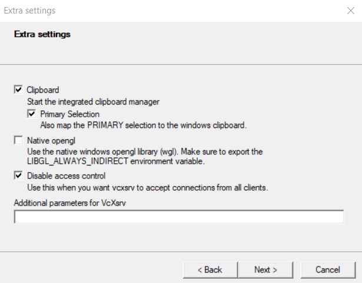
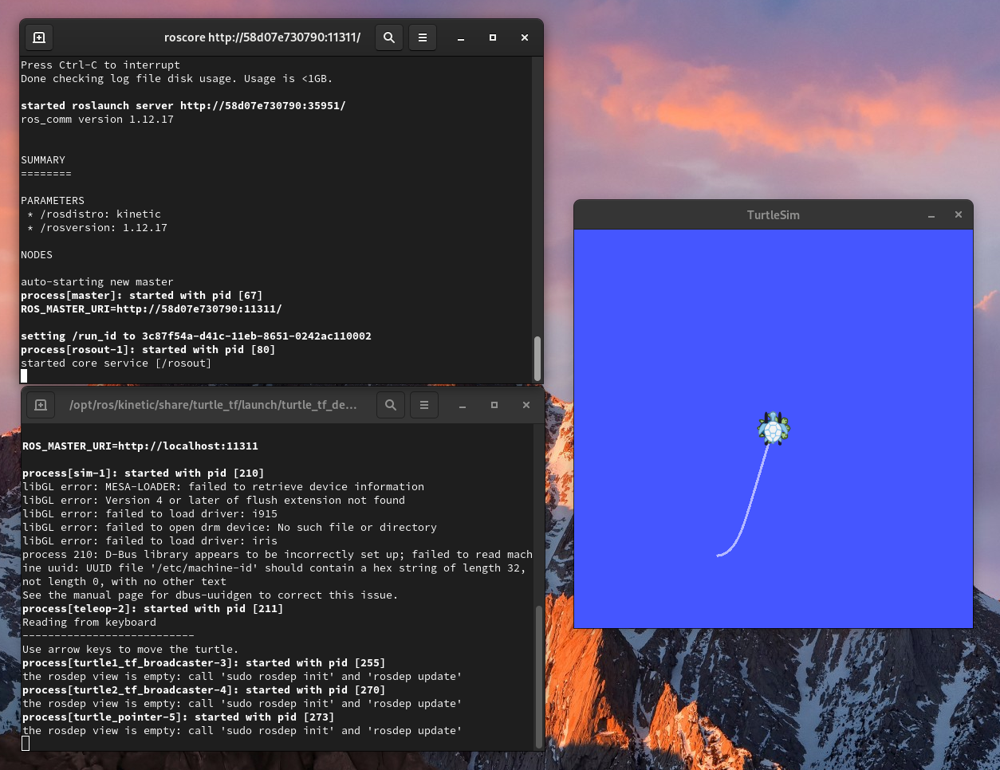

# **ROS Docker Tutorial**

## 1. Installing Docker

---

### **1.1 Windows**

### 1.1.1 WSL 2 backend

In order to use Docker on Windows, we first need to install _Windows Subsystem for Linux_ (WSL 2 for short) on the working machine. [Here](https://docs.microsoft.com/en-us/windows/wsl/install-win10) you can access a more detailed guide on how to perform the installation.

### 1.1.2 Docker installer

You can get the installer on [Docker Hub](https://hub.docker.com/editions/community/docker-ce-desktop-windows/).

* Run the installer and make sure you have **Enable Hyper-V Windows Features** or the **Install required Windows components for WSL 2** selected;
* Follow the instructions on the prompt and click on **Close** at the end to finish the process.

For a more detailed guide and troubleshooting: https://docs.docker.com/docker-for-windows/install/#install-docker-desktop-on-windows
### **1.2 Linux distros**

Content source: https://docs.docker.com/engine/install/fedora/

### 1.2.1 Fedora

* Setting up the repository

Install the dnf-plugins-core package (which provides the commands to manage your DNF repositories) and set up the stable repository.

``` bash
$ sudo dnf -y install dnf-plugins-core

$ sudo dnf config-manager \
    --add-repo \
    https://download.docker.com/linux/fedora/docker-ce.repo
```

* Installing Docker engine

Install the latest version of Docker Engine and containerd, or go to the next step to install a specific version:

``` bash
$ sudo dnf install docker-ce docker-ce-cli containerd.io
```

If prompted to accept the GPG key, verify that the fingerprint matches `060A 61C5 1B55 8A7F 742B 77AA C52F EB6B 621E 9F35`, and if so, accept it.

Docker is installed but not started. The docker group is created, but no users are added to the group. To start docker:

``` bash
$ sudo systemctl start docker
```

Verify that Docker Engine is installed correctly by running the hello-world image:

``` bash
$ sudo docker run hello-world
```

This command downloads a test image and runs it in a container. When the container runs, it prints an informational message and exits.

_OBS: Docker Engine is installed and running. You need to use `sudo` to run Docker commands. Continue to Linux postinstall to allow non-privileged users to run Docker commands and for other optional configuration steps._

## 2. Pulling ROS image

---

_Content souce: https://jack-kawell.com/2019/09/11/setting-up-ros-in-windows-through-docker/_

After finishing Docker installation and tested if it's working, it's time to pull our ROS image. In order to continue, open an _Power shell_ on Windows or a shell on your Linux to run Docker commands.

There're a wide range of ROS' distributions available on [Docker Hub](https://hub.docker.com/_/ros). For this guide we're going to use Kinetic (for other distributions, just switch `kinetic` on commands for your version of choice).

* First pull the image. We're pulling the `desktop-full` image that contains all ROS packages available:

``` console
$ docker pull osrf/ros:kinetic-desktop-full
```

* Once it's finished we can run the image:

``` console
$ docker run --name ros-dev -it osrf/ros:kinetic-desktop-full bash
```

The above command does a few things:

- docker run simply states that we wish to run a Docker image and turn it into a container.
- --name ros-dev is naming the container (you can use any name you want instead of ros-dev).
- -it {image_name} bash basically means we want to run the container interactively (ie. we wish to ssh into it and use bash).
- osrf/ros:kinetic-desktop-full is simply the image name we wish to run as a container. I am using the desktop-full version of ROS here, but there are smaller images out there that work as well. They just require other packages to be installed later for advanced functionality.

Once this command runs, you should be popped straight into the shell of your new ROS container. We still need a little configuration to properly set it up though.

* In order to run ROS commands we need to source `setup.bash` on every shell. To facilitate this process, let's add the following line to bashrc:

``` console
$ echo source "/opt/ros/kinetic/setup.bash" >> ~/.bashrc
```

This will add the ROS sourcing script to your .bashrc file so that it will be loaded every time you create a new terminal. Now we need to source it for our current terminal:

``` console
$ source ~/.bashrc
```

Now let’s see if our ROS installation is properly working:

``` console
$ roscore
```

If you get something like the following, you’re system is working correctly!

```
... logging to /root/.ros/log/58f66bc2-d4a4-11e9-be85-02420aff0002/roslaunch-59fe088dbe6a-325.log
Checking log directory for disk usage. This may take awhile.
Press Ctrl-C to interrupt
Done checking log file disk usage. Usage is <1GB.
 
started roslaunch server http://59fe088dbe6a:34269/ros_comm version 1.12.14
 
 
SUMMARY
========
 
PARAMETERS
 * /rosdistro: kinetic
 * /rosversion: 1.12.14
 
NODES
 
auto-starting new master
process[master]: started with pid [335]
ROS_MASTER_URI=http://59fe088dbe6a:11311/
 
setting /run_id to 58f66bc2-d4a4-11e9-be85-02420aff0002
process[rosout-1]: started with pid [348]
started core service [/rosout]
```

Now you’ve got a perfectly good ROS development environment all set up at this point. Anytime you want to develop in ROS, simply open a Powershell window and run the command below (make sure to substitute in the container name you chose to use before:

``` console
$ docker exec -it ros-dev bash
```

## 3. Setting GUI forwarding

---

### **3.1 Windows**

* Install VcXsrv, you can get it [here](https://sourceforge.net/projects/vcxsrv/)
* Once you run the installer you may need to launch it from Start in order to set it up. You can simply press “next” a few times to accept all the defaults and then select “finish” to close it out. You should now see it’s icon down in your icon tray which means the server is running. Note: right before you click “finish” you can select “Save configuration” so that you can simply double-click the config file to launch VcXsrv with all the defaults. This is a bit faster than clicking through every time.

Note: You may want to uncheck “Native opengl” and check “Disable access control”. On different systems I’ve had issues with the defaults here. Your mileage may vary.



* Once that’s set up, you can now jump into your ROS container and setup the necessary bits on that side. Open a new Powershell window and launch an interactive shell into your ROS container using the command we used before:

``` console
$ docker exec -it ros-dev bash
```

* Once you’re in the container, we need to set the DISPLAY environment variable which tells the container where to send the graphics for any application that needs a display to function. To do this, you’ll need to know the IP address for the Windows host machine. You can find this by going to Settings -> Network & Internet and looking under the properties of your current connection (it will probably be labeled as “IPv4 Address”). Then run this command and replace the placeholder with your IP address:

``` console
$ echo 'export DISPLAY={your_ip_address}:0.0' >> ~/.bashrc
```

_NOTE: If you’re running this on a laptop then your IP address will change as you move from network to network. Also, if you’re on a larger network (at a school campus or big company) you’re IP may change from time to time. Just keep this in mind that you may need to update this every once in a while._

* Now source your edited .bashrc file:

``` console
$ source ~/.bashrc
```

* And run the roscore command to launch your ROS master node. Finally, you’ll need to open up another ROS terminal through another Powershell window and then run the below command to test out your GUI forwarding:

``` console
$ roslaunch turtle_tf turtle_tf_demo.launch
```

You should see a window appear with a working demo of TurtleSim:



### **3.1 Fedora**

Setting up GUI forwarding on Linux can be more tricky than on a Windows machine. However, the Dockerfile and launch files in this repo can help making it easier.

* Create the docker image running:

``` console
$ sudo docker build -t ros-dev .
```

* _If it prompts an error telling you that an instance with this name already exists, just stop and remove the old instace by running:_

``` console
$ sudo docker stop ros-dev

$ sudo docker rm ros-dev
```

_Then try building the image again_

* Now you can use the `launch.sh` file to run your main shell:

``` console
$ ./launch.sh
```

* This will open the container bash, and then run your `roscore`:

``` console
$ roscore
```

* Now, in a new shell, run Turtlesim demo to see if everything is working properly:

``` console
$ roslaunch turtle_tf turtle_tf_demo.launch
```

You should see a window appear with a working demo of TurtleSim:


